# REST-API Project
Sample REST project

This project consist of three APIs that are some elements from an e-commerce program

###The second API is Product API:
```bash
This API consist of:
1.ID as primary key
2.Name
3.Description
4.Purchasing price
5.Selling price
6.Expiry date
7.Category
```
```bash
This API does 5 functions:

1. Find all the products in the database
The request shape is: 
localhost:9090/e-commerce/customer
The response will be as:
```
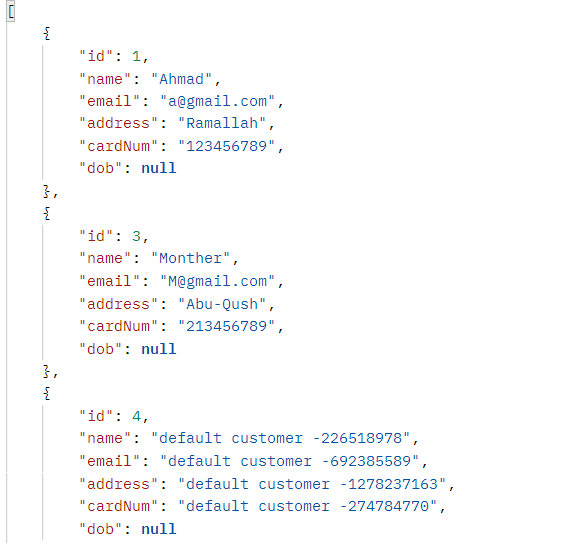
```bash
2. Find a customer by id
The request is:
localhost:9090/e-commerce/customer/{id}
the response is:
```
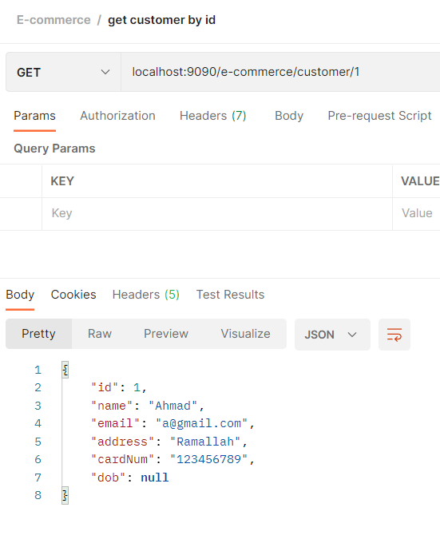
```bash
3. create a customer
The request is:
localhost:9090/e-commerce/customer
the response is:
```
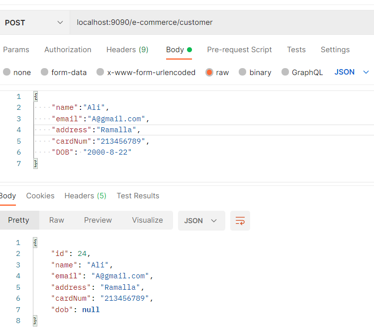

```bash
4. update a customer information using their id
The request is:
localhost:9090/e-commerce/customer/{id}
the response is:
```
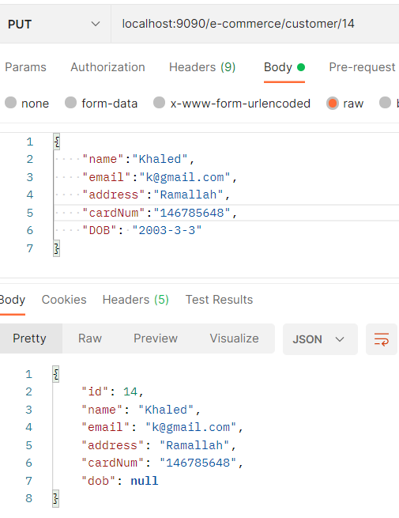
```bash
5. deleting a customer using id
The request is:
localhost:9090/e-commerce/customer/{id}
the response is:
```
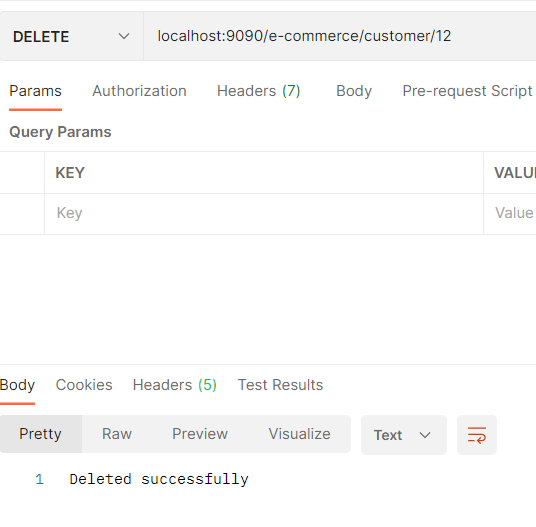

###The second API is Products API:
```bash
This API consist of:
1.ID as primary key
2.Name
3.Email
4.Address
5.Card number
6.Date of birth
```
```bash
This API does 5 functions:

1. Find all the products in the database
The request shape is: 
localhost:9090/e-commerce/products
The response will be as:
```
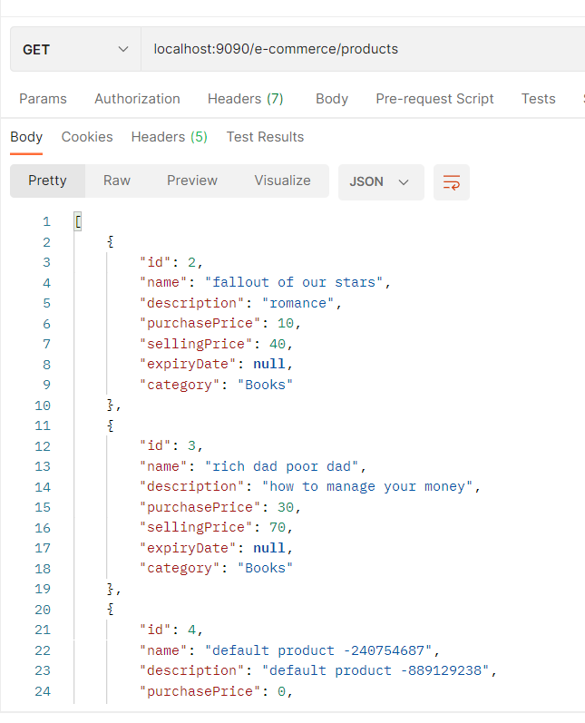
```bash
2. Find a product by id
The request is:
localhost:9090/e-commerce/products/{id}
the response is:
```
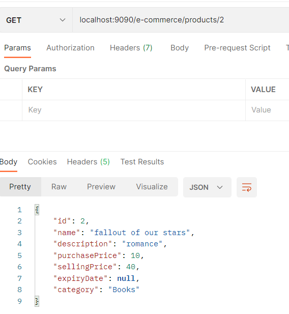
```bash
3. create a product
The request is:
localhost:9090/e-commerce/products
the response is:
```
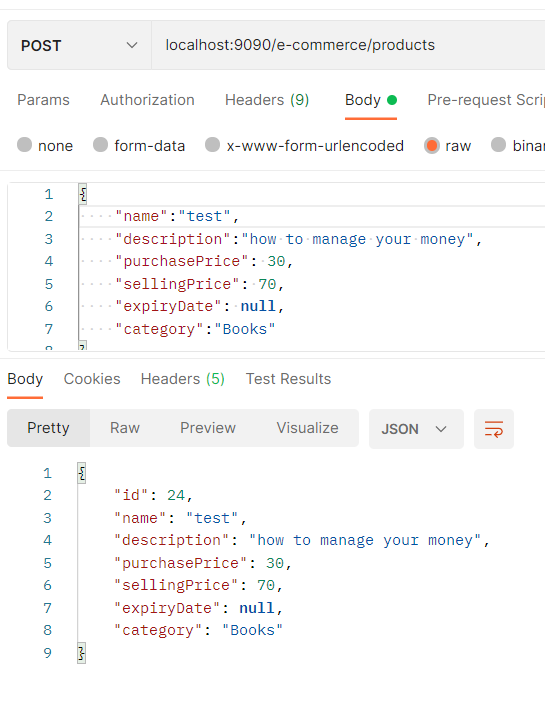

```bash
4. update a product information using their id
The request is:
localhost:9090/e-commerce/products/{id}
the response is:
```
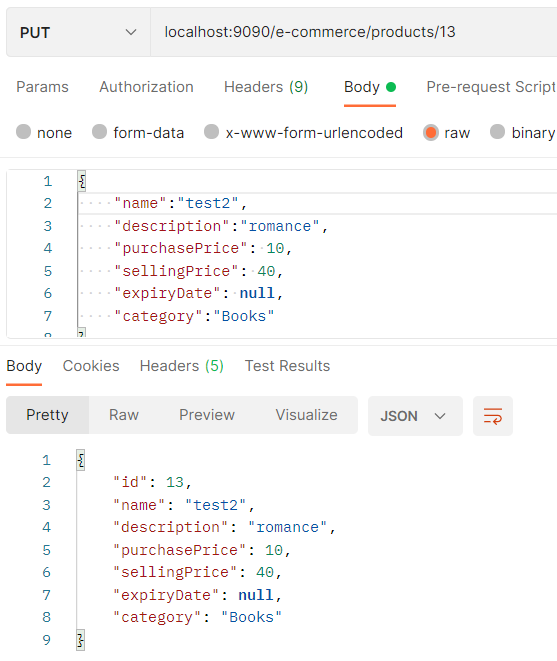
```bash
5. deleting a product using id
The request is:
localhost:9090/e-commerce/products/{id}
the response is:
```
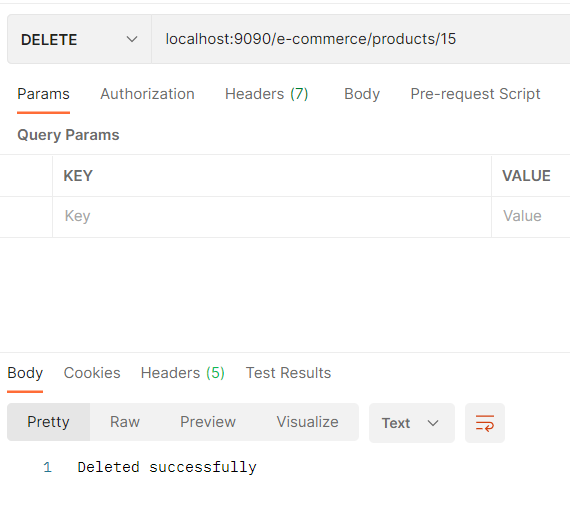

###The third API is Category API:
```bash
This API consist of:
1.ID as primary key
2.Name
3.Description
```
```bash
This API does 5 functions:

1. Find all the Categories in the database
The request shape is: 
localhost:9090/e-commerce/category
The response will be as:
```
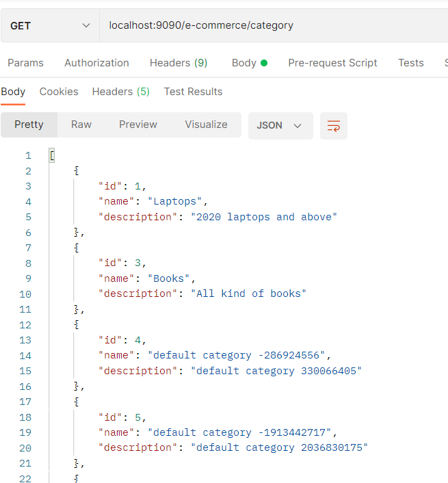
```bash
2. Find a category by id
The request is:
localhost:9090/e-commerce/category/{id}
the response is:
```
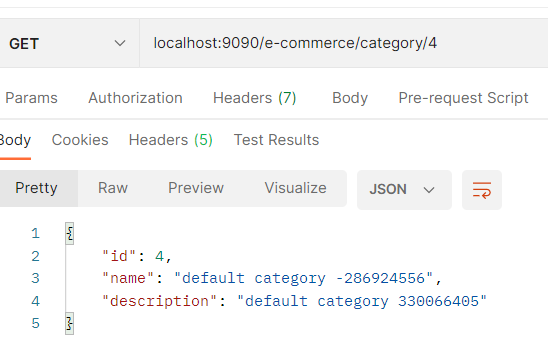
```bash
3. create a category
The request is:
localhost:9090/e-commerce/category
the response is:
```
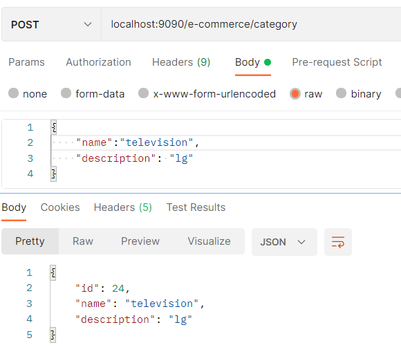

```bash
4. update a category information using their id
The request is:
localhost:9090/e-commerce/category/{id}
the response is:
```
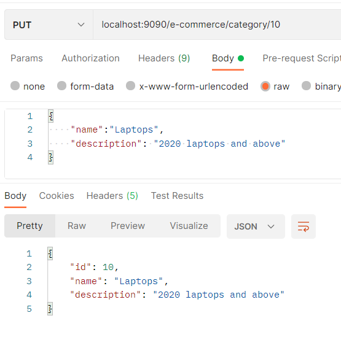
```bash
5. deleting a category using id
The request is:
localhost:9090/e-commerce/category/{id}
the response is:
```
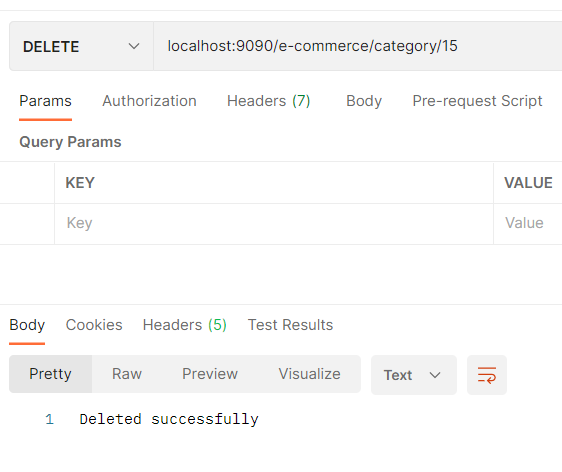